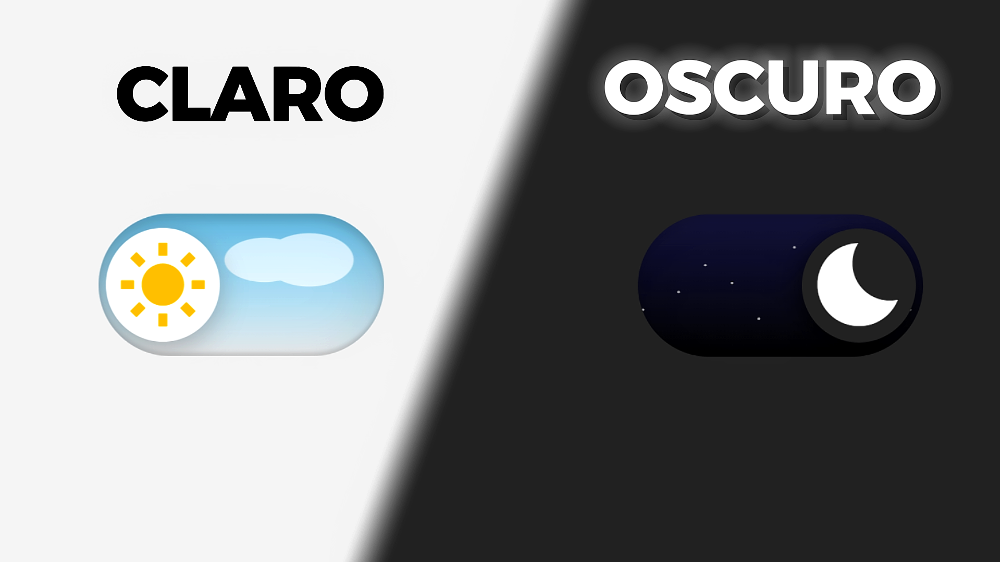

# Botón de Modo Claro/Oscuro con Animaciones Dinámicas✨
## Vista Previa

¡Así es como quedó el botón! 

**Por: [DevBy Lualmara](https://github.com/Lualmara-5)**

---

## Descripción

Este proyecto es un botón de cambio de tema (Modo Claro/Oscuro) con una animación interactiva que simula un cielo nocturno con estrellas en movimiento y una nube flotante. Está desarrollado con **HTML**, **CSS** y **JavaScript**, logrando un efecto dinámico y atractivo para mejorar la experiencia visual del usuario.

El código está optimizado para transiciones suaves y sin cortes visibles, asegurando una animación fluida y estética. Ideal para proyectos web que requieran un interruptor de modo oscuro con efectos visuales envolventes.✨

El tutorial paso a paso para crear este botón estará disponible en el canal de YouTube **[DevBy Lualmara](https://www.youtube.com/@DevByLualmara)**.

---

## ¡Dame tu Apoyo!

Si te ha gustado este formulario, no dudes en darme una ⭐ al repositorio. ¡Eso me ayuda mucho a seguir creando contenido y mejorando mis proyectos!

---
